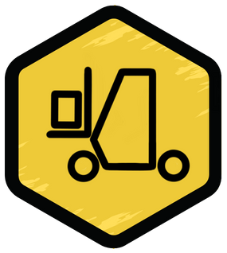
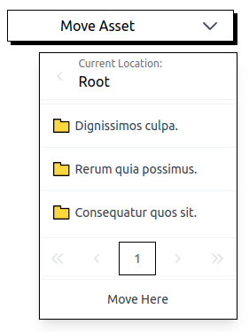

<p align="center">

</p>


# Forklift

> Laravel Livewire Component

<p align="center">

</p>

```shell
composer require kanata-php/forklift
```

Move assets in a predictable and easy manner with Eloquent and Livewire.

## Dependencies

- Laravel
- Livewire
- AlpineJS

## Installation

**Step 1**

Install composer package:

```shell
composer require kanata-php/forklift
```

**Step 2**

Publish the assets registered in the Service Provider:

```shell
php artisan vendor:publish --provider="Kanata\Forklift\ForkliftServiceProvider"
```

After this you'll find the assets at the directory `resources/views/vendor/forklift`. At the current version the initial assets are only presentable for projects usign [Tailwind CSS](https://tailwindcss.com/).

**Step 3**

Implement the `Kanata\Forklift\Interfaces\AssetRepositoryInterface` for the component to know how to interact with your project's models.

Methods:

- `AssetRepositoryInterface::changeCurrentLocation` - This method returns current location's "sub locations". This is equivalent to sub folders when you have a folder based structure like a filesystem navigation.

- `AssetRepositoryInterface::moveAsset` - This method executes the movement between locations of the asset being managed.  

## Usage

Let's assume we have a filesystem structure. In this structure you have documents and directories. This package adds a dropdown that allows quickly moving assets in the directory structure.

For such, using eloquent, we would have the models:

- **Directory** - that keeps the directries structure, having subdirectories and documents inside them.
> Example migration:
> ```php
> Schema::create('directories', function (Blueprint $table) {
>     $table->id();
>     $table->string('title', 40);
>     $table->foreignId('parent')->nullable();
>     $table->timestamps();
> });
> ```

- **Document** - that keeps the documents.
> Example migration:
> ```php
> Schema::create('documents', function (Blueprint $table) {
>     $table->id();
>     $table->string('title', 40);
>     $table->longText('content');
>     $table->foreignId('directory_id')->nullable();
>     $table->timestamps();
> });
> ```

The following component is the **dropdown** to move documents:

```html
@livewire('forklift-dropdown', [
    'currentLocationId' => $document->directory_id,
    'locationType' => \App\Models\Directory::class,
    'assetId' => $document->id,
    'assetType' => \App\Models\Document::class,
    'assetRepository' => App\Repositories\DocumentAssetRepository::class,
    'parentField' => 'directory_id',
])
```

The following component is the dropdown to move directories:

```html
@livewire('forklift-dropdown', [
    'currentLocationId' => $directory->parent,
    'locationType' => \App\Models\Directory::class,
    'assetId' => $directory->id,
    'assetType' => \App\Models\Directory::class,
    'assetRepository' => App\Repositories\DirecotryAssetRepository::class,
    'parentField' => 'parent',
])
```

You can find an example laravel project [here](https://github.com/kanata-php/forklift-example).

## Todo

- Change UI when backend error happens.
